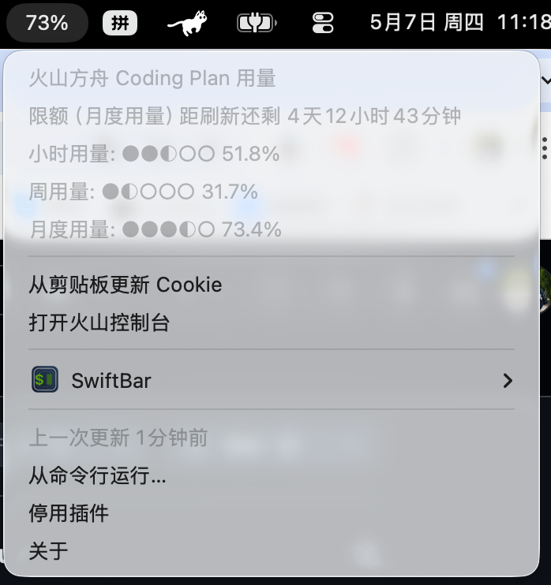

Volcengine Ark Coding Plan Usage
火山方舟Coding Plan用量监控插件
=====================

<br />

用于 macOS 菜单栏（xbar / SwiftBar）的火山方舟 Coding Plan 用量监控插件，实时显示 API 用量进度，帮助开发者及时了解资源使用情况。

**特性亮点：**
- 实时监控 Coding Plan 用量（小时/周/月三个维度）
- 自动高亮显示用量最高的维度
- 简洁直观的进度条展示
- 支持 xbar 和 SwiftBar 双平台



## 功能

- **顶部菜单栏** — 自动显示 **小时 / 周 / 月** 三个维度中用量最高的进度条
- **下拉菜单** — 展开查看三个维度的详细用量百分比：
  - 小时用量（5 小时滚动窗口）
  - 周用量（近 7 天）
  - 月度用量（近 30 天）

## 前置要求

- macOS
- [xbar](https://xbarapp.com/) 或 [SwiftBar](https://swiftbar.app/)

## 安装

```bash
# 1. 克隆或下载本仓库
git clone https://github.com/xiaokaiyyy/ArkCodingPlanUsage.git
cd ArkCodingPlanUsage

# 2. 复制插件到 xbar 插件目录
cp ark_usage.5m.py ~/Library/Application\ Support/xbar/plugins/

# 3. 确保脚本有执行权限
chmod +x ~/Library/Application\ Support/xbar/plugins/ark_usage.5m.py
```

> 文件名中的 `5m` 表示每 5 分钟自动刷新一次。可修改为 `1m`、`10m`、`30m` 等。

## 配置

插件需要从火山方舟控制台获取 Cookie 才能调用内部 API。

**Cookie 文件保存位置**：`~/.config/ark_cookie.txt`（用户主目录下的 `.config` 文件夹中）

### 获取 Cookie

1. **登录** [火山方舟控制台](https://console.volcengine.com/ark/region:ark+cn-beijing/openManagement)（保持登录状态）。
2. **打开浏览器开发者工具**：
   - Chrome：`F12` → 切换到 **Network**（网络）标签页
3. **刷新页面**（`Cmd + R`），在 Network 列表中找到名为 `GetCodingPlanUsage` 的请求。
4. **复制 Cookie**：
   - 右键该请求 → `Copy` → `Copy as cURL`
   - 从复制的命令中找到 `-b` 后面的字符串，即 Cookie 值
   或者直接在 Request Headers 中复制 `Cookie` 字段的完整值。

### 写入 Cookie 文件

```bash
# 创建配置目录
mkdir -p ~/.config

# 将 Cookie 写入文件（注意保留完整字符串）
echo '你的Cookie字符串' > ~/.config/ark_cookie.txt
```

### 刷新插件

- **xbar**：右键菜单栏图标 → Refresh
- **SwiftBar**：右键菜单栏图标 → Refresh All

刷新后，菜单栏应显示当前用量进度条。

## 常见问题

| 问题                | 原因                             | 解决                 |
| ----------------- | ------------------------------ | ------------------ |
| 菜单栏显示 "无 Cookie"  | `~/.config/ark_cookie.txt` 不存在 | 按上文步骤写入 Cookie     |
| 菜单栏显示 "Cookie 过期" | Cookie 已失效                     | 重新登录控制台，获取新 Cookie |
| 显示用量为 0%          | 当前周期内无 API 调用                  | 正常现象，有调用后自动更新      |

## 文件说明

| 文件                | 说明                    |
| ----------------- | --------------------- |
| `ark_usage.5m.py` | xbar / SwiftBar 插件主程序 |
| `README.md`       | 本文档                   |

## License

MIT License — 详见 [LICENSE](LICENSE) 文件。
